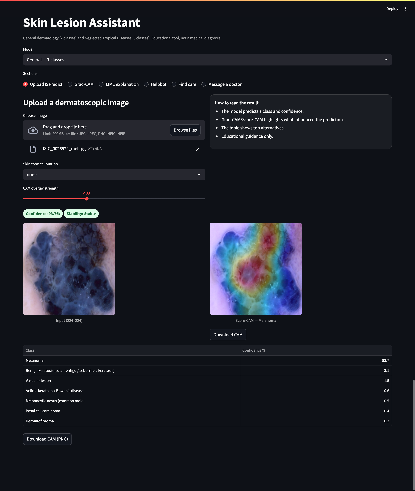
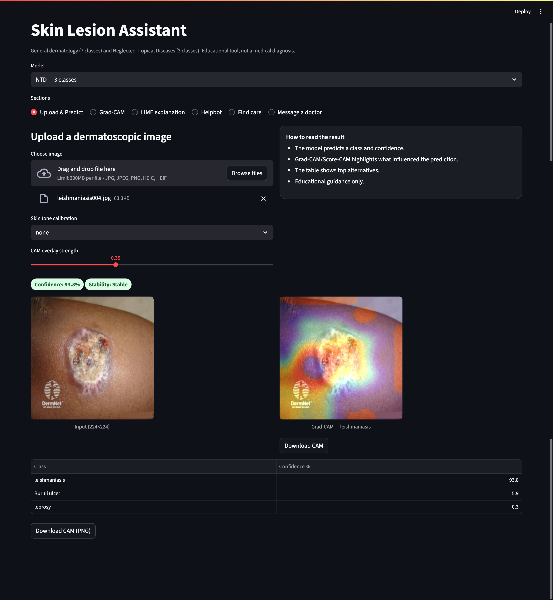
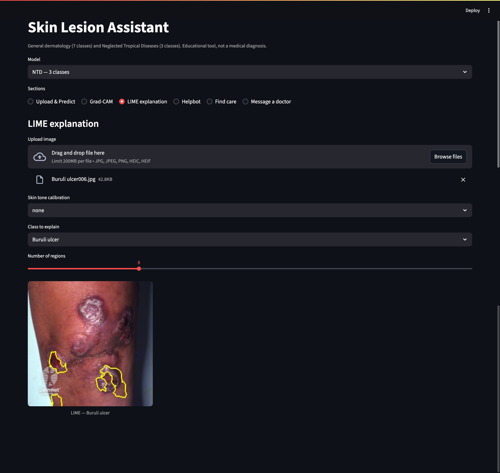
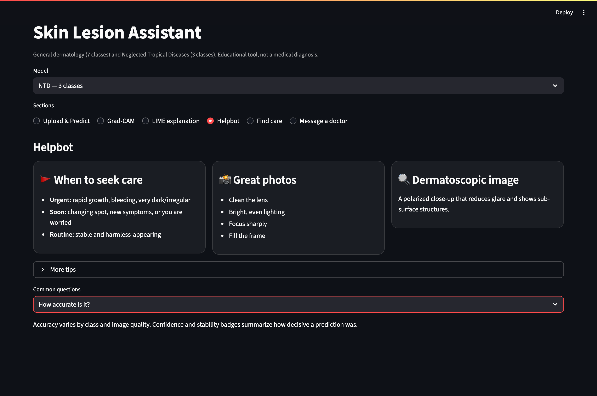

# Skin Lesion Assistant — General + NTD

Two educational image models wrapped in a Streamlit app:

- **General dermatology (7 classes)** — inference via a SavedModel wrapper with **Score-CAM**.
- **Neglected Tropical Diseases (3 classes: Buruli ulcer, leishmaniasis, leprosy)** — MobileNetV2 with **Grad-CAM**, guardrails, and **LIME**.

## Files needed in this folder
- app7.py
- labels7.json and ham10000_effnet7_cam/
- ntd_mbv2_mix_final.keras, ntd_labels.json
- requirements.lock.txt
- docs/  (optional screenshots)

## Quick start
```bash
python3 -m venv .venv
source .venv/bin/activate
pip install -r requirements.lock.txt
streamlit run app7.py --server.port 8501
```

## How to use
1. Pick the model (7-class or NTD).
2. Upload an image (JPG/PNG; HEIC works if pillow-heif is installed).
3. See prediction, confidence/stability, CAM heatmap, and top-k table.
4. Optional LIME in the LIME tab.
5. Use Download CAM to save the overlay PNG.

## Troubleshooting
- HEIC support: `pip install pillow-heif`
- NumPy/TensorFlow mismatch: `pip install -r requirements.lock.txt`
- 7-class CAM wrapper present: `ham10000_effnet7_cam/saved_model.pb`

## Disclaimer
Educational/triage support only; not a diagnosis.












## How to run
python -m venv .venv
source .venv/bin/activate
pip install -r requirements.txt
streamlit run app7.py

## Repo structure
app7.py                Streamlit app
docs/                  Screenshots, demo assets
└── shot_general_cam.png
└── shot_ntd_cam.png
└── shot_lime.png
└── shot_helpbot.png

[Watch the demo (MP4)](https://github.com/dare1zone/skin-app-release/releases/latest/download/demo.mp4)
